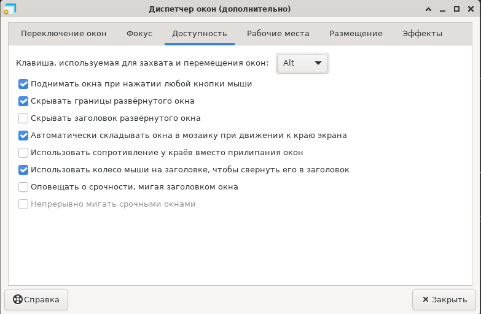

# Free Alt key for Xfce 4 GUI

By default, the Alt key + Left mouse on Xfce 4 is used for window moving and resizing.
Its problem for default alt key behavior for most applications such Figma or Visual Studio Code.
To switch off alt key binding in Xfce 4, you could follow these steps:

1. Open through start menu `Settings` -> `Window Manager Tweaks`
2. On open window click `availability` tab
3. Chose from dropdown list `none` or other key
4. Close window

